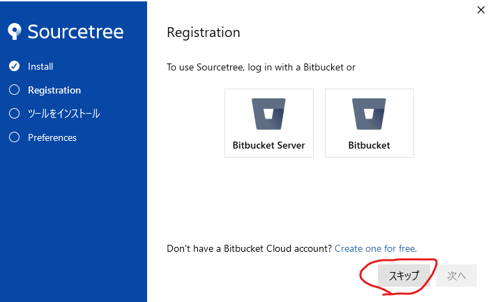
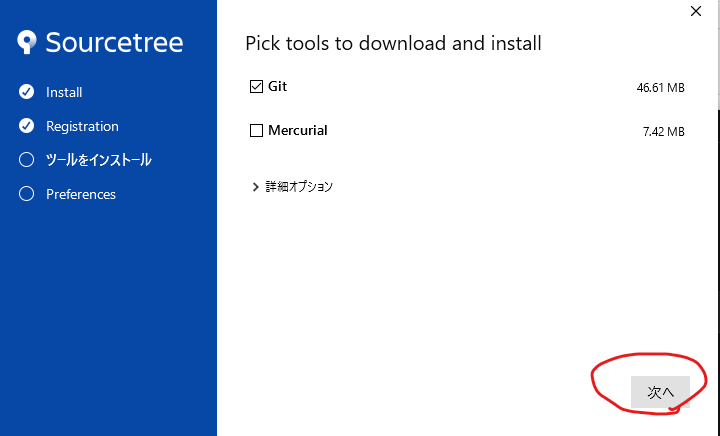

# FirstSparrowGames
tnp robo tps game
## 開発環境構築！（変なことしなければこれでできるはず...）
- ## Step1 Githubのアカウント作成  
  [ここ](https://github.com/signup?source=login)からGitHubのアカウントを作成し，ログイン
 

<h2>Step2 SourceTreeのインストール</h2>

   1\. [ここ](https://www.sourcetreeapp.com/)からSourceTreeをダウンロード 
      1-1\. 以下の様にインストールを行う  
      1-2\. スキップを押す  
        
      1-3\. 少なくともGitにチェックが入っていることを確認後，次へを押す  
        
      1-4\. Aouthor Name, Author Rmail Addressを入力し，次へ  
              ※GitHubと同じものにしておいた方がスムーズに進むかも  
                
      1-5\.  SSHキーを読み込みますか？と出た場合はいいえを選択  
        
  2\. GitHubアカウントとの連携  
      2-1\. 以下の画像の様にRemote→アカウントを追加をクリック  
        
      2-2\. ホスティングサービスにGitHubを選択した状態でOAuthトークンを再読み込みを押す  
        
      2-3\. ブラウザが開き，以下のような画面が出るのでAuthorize atlassianをクリック  
        
      2-4\. SourceTreeにも出ってきた後以下のような画面になってれば成功（黒塗り部分はGitHubのユーザー名が入る）  
        

  
- ## Step3 Organizationに参加  
  - GitHubでのSparrow Gamesのチーム（Organization）に招待するのでここまで出来たらディスコでmilion1954までご連絡!  
  - 追伸 Sparrow Gamesの名前は派生形含めて確保されていたのでSparrow Games Studio になりました．  

- ## Step 4 SparrowGamesStudioのリポジトリをSourceTreeのローカルリポジトリにクローン
- 参加完了後はまず，プロジェクトを保存したい場所に空のフォルダを作成しておく． － ➀
- 次に画面上のCloneを選択し，
  [この](https://rarafy.com/blog/2022/06/14/github-organization-not-correct-url/)サイトの解決の手順に従ってクローンを行う．  
  ただし，現在は，Personal access tokensの項目にFine-grained tokensとTokens(Classic)の２つがあるため，Tokens(Classic)でのトークンの作成を行う．  
  ソースパスは  
  `https://（ここにトークンを入力）github.com/SparrowGamesStudio/FirstSparrowGames.git  `
  とする.
  cloneを押した際にいろいろな項目が出てきた場合windowsならwincred,MACならosxkeychainにチェックを入れるととても幸せ  
  保存先のパスには➀で指定したフォルダを選択する
  
 - ## Step5 変更のステージからpushまで
      5-1\. step4でクローンしたリポジトリの中に'hoge.md'というファイルがあるのでそれをメモ帳か何かで開いて適当に入力して保存する．  
      5-2\. 
    
